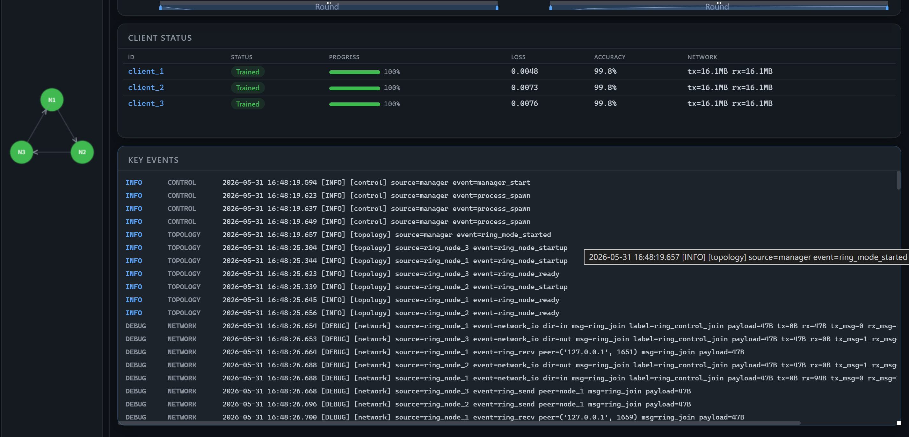
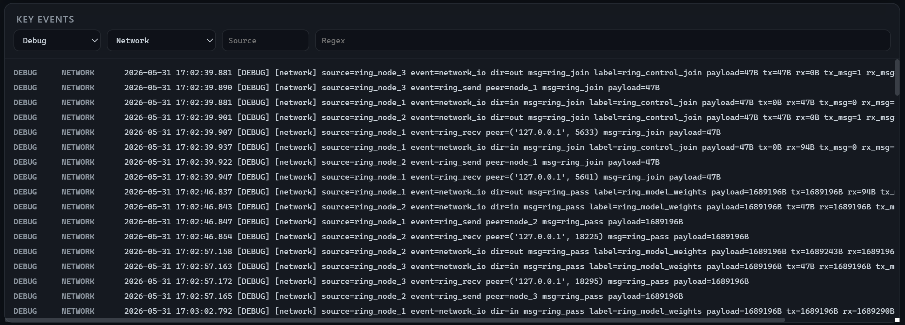
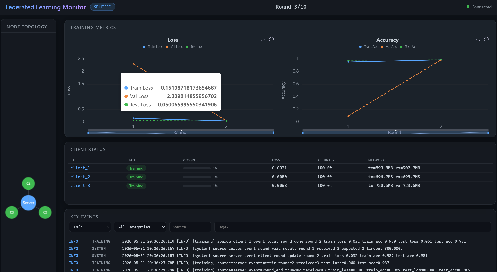
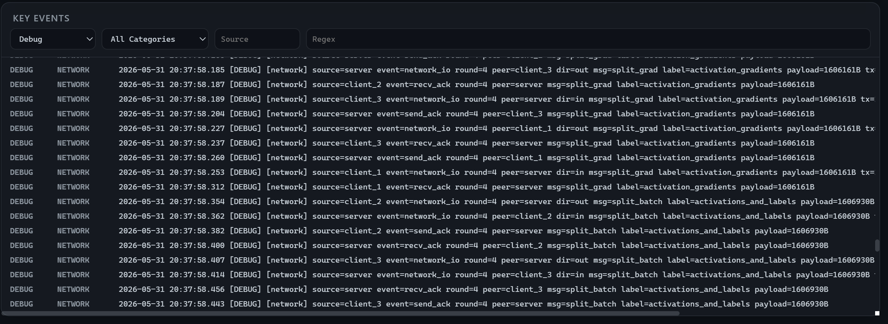
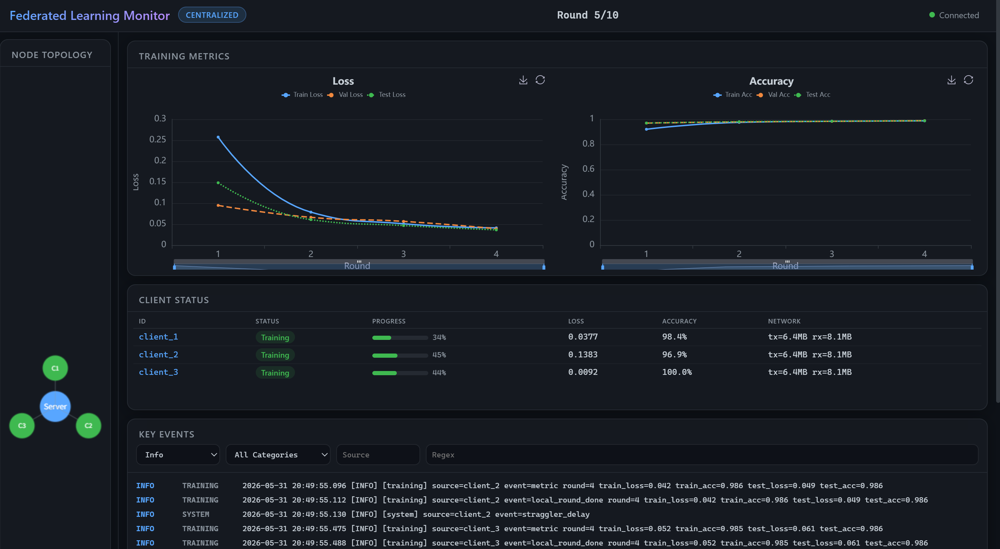
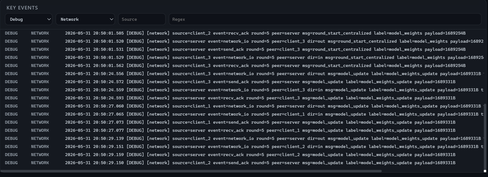

# 测试报告

| 模式 | 对应训练目录 | 完成轮次 | 最终测试准确率 | 最终测试损失 | 最佳轮次 | 运行时长 |
| --- | --- | ---: | ---: | ---: | ---: | ---: |
| Ring | `logs/20260531170228` | 9 / 10 | 0.9901 | 0.0341 | 9 | 214.1s |
| SplitFed | `logs/20260531202500` | 4 / 10 | 0.9904 | 0.0297 | 4 | 334.2s |
| Centralized | `logs/20260531205240` | 6 / 10 | 0.9900 | 0.0295 | 6 | 192.5s |

三种模式最终测试准确率均达到约 99%。其中 SplitFed 在第 4 轮达到目标准确率，收敛轮次最少，但由于需要频繁传输切分层的激活值与梯度，网络通信量明显高于另外两种模式。Centralized 在第 6 轮达到目标准确率，通信量较低、总耗时最短。Ring 在第 9 轮达到本次训练中的最佳结果，最终准确率为 0.9901。

## 1. Ring 模式

### 训练结果

- 训练目录：`logs/20260531170228`
- 完成轮次：9 / 10
- 最终测试准确率：0.9901
- 最终测试损失：0.0341
- 最终训练准确率：0.9979
- 最终训练损失：0.0070
- 最终验证准确率：0.9937
- 最终验证损失：0.0226
- 最佳轮次：第 9 轮
- 运行时长：214.1s
- 网络发送量：约 43.5 MB
- 网络接收量：约 43.5 MB
- 发送消息数：31
- 接收消息数：30
- 慢节点记录：`node_2` 共延迟 9 次
- 丢弃节点数：0

Ring 模式下各节点按环形结构进行模型传递和聚合。本次训练记录到第 9 轮时达到最终最优结果，测试准确率为 0.9901，测试损失为 0.0341。

### 监测网页截图

### 网络监测日志截图

### Loss 曲线

### Accuracy 曲线

## 2. SplitFed 模式

### 训练结果

- 训练目录：`logs/20260531202500`
- 完成轮次：4 / 10
- 最终测试准确率：0.9904
- 最终测试损失：0.0297
- 最终训练准确率：0.9933
- 最终训练损失：0.0206
- 最终验证准确率：0.9895
- 最终验证损失：0.0347
- 最佳轮次：第 4 轮
- 运行时长：334.2s
- 网络发送量：约 9.0 GB
- 网络接收量：约 9.0 GB
- 发送消息数：6049
- 接收消息数：6049
- 慢客户端记录：`client_2` 共延迟 4 次
- 丢弃客户端数：0

SplitFed 模式在第 4 轮达到目标准确率，监测日志中记录了 `target reached` 事件，因此训练提前停止。该模式最终测试准确率最高，为 0.9904；但通信量也最高，主要原因是训练过程中需要在客户端与服务端之间传输切分层的激活值和梯度。

### 监测网页截图

### 网络监测日志截图

### Loss 曲线

### Accuracy 曲线

## 3. Centralized 模式

### 训练结果

- 训练目录：`logs/20260531205240`
- 完成轮次：6 / 10
- 最终测试准确率：0.9900
- 最终测试损失：0.0295
- 最终训练准确率：0.9914
- 最终训练损失：0.0271
- 最终验证准确率：0.9885
- 最终验证损失：0.0375
- 最佳轮次：第 6 轮
- 运行时长：192.5s
- 网络发送量：约 58.0 MB
- 网络接收量：约 58.0 MB
- 发送消息数：45
- 接收消息数：45
- 慢客户端记录：`client_2` 共延迟 6 次
- 丢弃客户端数：0

Centralized 模式在第 6 轮达到目标准确率，监测日志中记录了 `target reached` 事件，因此训练提前停止。该模式最终测试准确率为 0.9900，测试损失为 0.0295，运行时长在三种模式中最短。

### 监测网页截图

### 网络监测日志截图

### Loss 曲线

### Accuracy 曲线

## 4. 对比分析

| 指标 | Ring | SplitFed | Centralized |
| --- | ---: | ---: | ---: |
| 完成轮次 | 9 | 4 | 6 |
| 最终测试准确率 | 0.9901 | 0.9904 | 0.9900 |
| 最终测试损失 | 0.0341 | 0.0297 | 0.0295 |
| 运行时长 | 214.1s | 334.2s | 192.5s |
| 网络发送量 | 43.5 MB | 9.0 GB | 58.0 MB |
| 网络接收量 | 43.5 MB | 9.0 GB | 58.0 MB |
| 消息发送 / 接收 | 31 / 30 | 6049 / 6049 | 45 / 45 |

从结果看，三种训练模式都能达到约 99% 的 MNIST 测试准确率。SplitFed 的收敛轮次最少，最终准确率略高，但网络通信开销最大；Centralized 的总耗时最短，通信量也较低；Ring 模式不依赖中心化训练流程，但达到最佳结果所需轮次更多。

本次测试中均存在由配置造成的慢节点或慢客户端记录，主要集中在 `client_2` 或 `node_2`，但三次训练均未出现客户端被丢弃的情况，因此最终指标可以作为有效实验结果使用。
