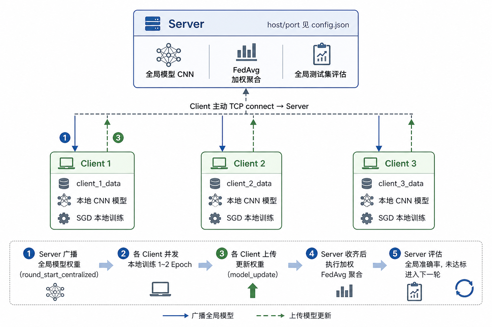
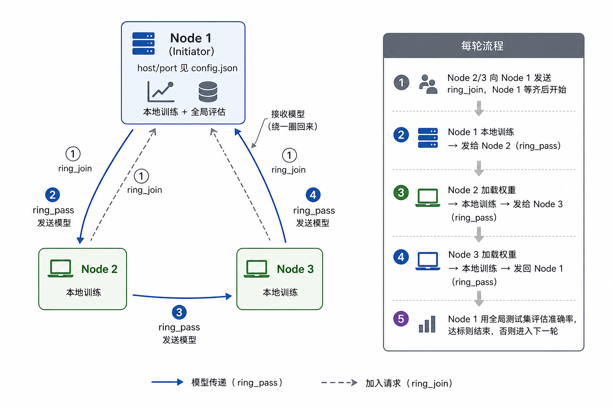
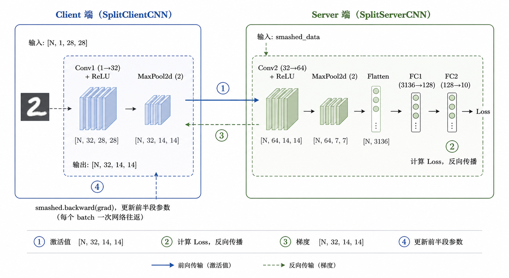

# 联邦学习实验框架 · 设计文档

---

## 1. 系统架构图

### 1.1 Centralized 模式


### 1.2 SplitFed 模式



### 1.3 Ring 去中心化模式



---

## 2. TCP 封包结构定义

### 2.1 封包格式

所有模式统一使用以下封包格式，定义于 `core/communicator.py`：

```
┌──────────────────┬──────────────────┬──────────────────────────────┐
│  Length Header   │   Magic Number   │           Payload            │
│     8 字节        │     4 字节        │          L 字节              │
│  struct('>Q')    │    b'SF26'       │  pickle 序列化 + 可选 gzip   │
└──────────────────┴──────────────────┴──────────────────────────────┘
```

- **Length Header**：无符号 64 位大端整数，表示 Payload 的字节长度 L
- **Magic Number**：固定字节串 `b'SF26'`，接收方校验此字段防止数据包错乱
- **Payload**：`pickle.dumps(message_dict)` 序列化的字节流，启用压缩时额外经过 `gzip.compress`

### 2.2 粘包解决方案

TCP 是字节流协议，不保证消息边界，直接 `recv` 会导致模型数据被截断。本系统采用定长头部方案解决：

```python
# 发送方
serialized = pickle.dumps(message_dict)
if use_compression:
    serialized = gzip.compress(serialized)
header = struct.pack('>Q', len(serialized))   # 8 字节长度头
magic  = b'SF26'                              # 4 字节魔数
sock.sendall(header + magic + serialized)     # 一次性发出

# 接收方
raw_len   = _recvall(sock, 8)                 # 精确读 8 字节
L         = struct.unpack('>Q', raw_len)[0]   # 解析长度 L
raw_magic = _recvall(sock, 4)                 # 精确读 4 字节魔数
assert raw_magic == b'SF26'                   # 校验
payload   = _recvall(sock, L)                 # 精确读 L 字节

# _recvall：while 循环累积，直到读满指定字节数
def _recvall(sock, num_bytes):
    data = bytearray()
    while len(data) < num_bytes:
        packet = sock.recv(num_bytes - len(data))
        if not packet:
            return None
        data.extend(packet)
    return data
```
